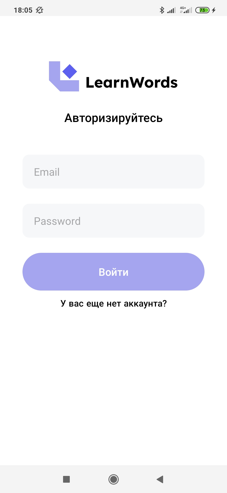

# LerWord [MVC,Room,Coroutines]
This repository is an example of the implementation of the MVC pattern on Android.

## Diagram
Diagram of a standardly implemented MVC pattern
</img>

## Screenshots
Screenshot of each window

</img>
</img>
</img>

## Structure

#### Model
The model is presented in the form of two repositories that provide suspend functions for receiving data
- `UserRepository` - implemented using the Room library
- `WordsRepository` -implemented by a regular class, like a simulated database

#### View
View are the generated classes, thus the activity code remains almost empty
- `ActivityImplementor` - classes for each screen
- `Activity` - classic activity to support the life cycle
- `Adapter` & `AdapterImplementor` - adapter for recyclerview
  
#### Controller
Controllers store all application logic

