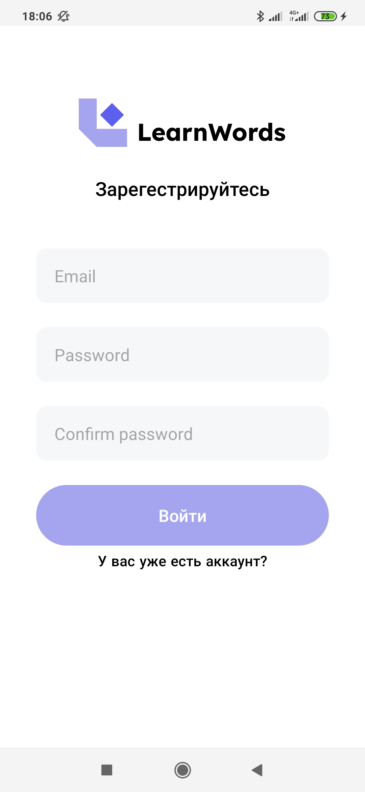

# LerWord [MVC,Room,Coroutines]
This repository is an example of the implementation of the MVC pattern on Android.

## Diagram
Diagram of a standardly implemented MVC pattern
</img>

## Screenshots
Screenshot of each window
</img>
</img>
</img>

